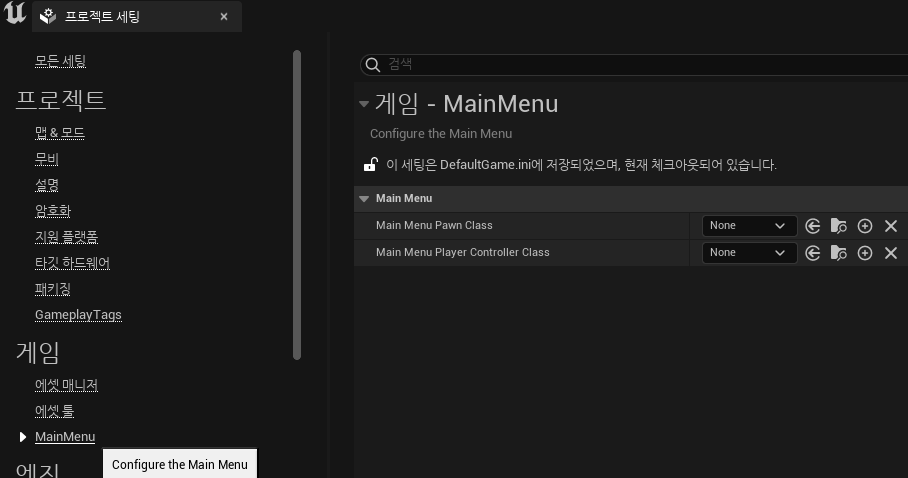

# 2023-01-27-HowToExposeMySettingsToUnrealProjectSettings

---
title : 내 게임의 세팅을 언리얼 에디터 프로젝트 세팅에 노출하는 방법
date: 2023-01-27 20:09:00 +0900
categories: [언리얼, 프로그래밍]
tags: [언리얼, 프로그래밍]
---


모듈 별로 하나씩 만들어두면 편하게 쓰인다.

우선 세팅에 노출할 클래스를 작성한다. 나는 UObject를 상속한 클래스를 하나 만들었다.

클래스에 다음과 같이 지정자를 추가해준다.

```cpp
UCLASS(config=Game, defaultconfig)
class MAINMENU_API UMainMenuSettings : public UObject
```

이후 세팅에 노출시키고 싶은 프로퍼티를 다음과 같은 지시자를 달아준다.

```cpp
UPROPERTY(config, EditAnywhere, Category = "MainMenu")
TSubclassOf<class AMainMenuPawn> MainMenuPawnClass;
```

세팅에 노출시켜서 사용할 클래스는 준비가 끝났다.

이제 이 클래스를 모듈에 등록해야 한다.

클래스가 위치한 모듈의 모듈 파일로 이동한다. 없으면 하나 만들자.

모듈의 StartupModule에서 SettingsModule 포인터를 얻어서 세팅을 등록하면 된다.

```cpp
void FMainMenu::StartupModule()
{
	if (ISettingsModule* SettingsModule = FModuleManager::GetModulePtr<ISettingsModule>("Settings"))
	{
		SettingsModule->RegisterSettings("Project", "Game", "MainMenu",
			INVTEXT("MainMenu"),
			INVTEXT("Configure the Main Menu"),
			GetMutableDefault<UMainMenuSettings>()
		);
	}
}

void FMainMenu::UnregisterSettings()
{
	if (ISettingsModule* SettingsModule = FModuleManager::GetModulePtr<ISettingsModule>("Settings"))
	{
		SettingsModule->UnregisterSettings("Project", "Game", "MainMenu");
	}
}
```

이제 엔진을 실행해보면 다음처럼 프로젝트 세팅에 섹션이 추가된 것을 볼 수 있다.



코드에서 참조하기 편하도록 아래처럼 게터를 만들어서 쓰는 것도 괜찮다.

```cpp
static FORCEINLINE UMainMenuSettings* Get()
{
	UMainMenuSettings* Settings = GetMutableDefault<UMainMenuSettings>();
	return Settings;
}
```